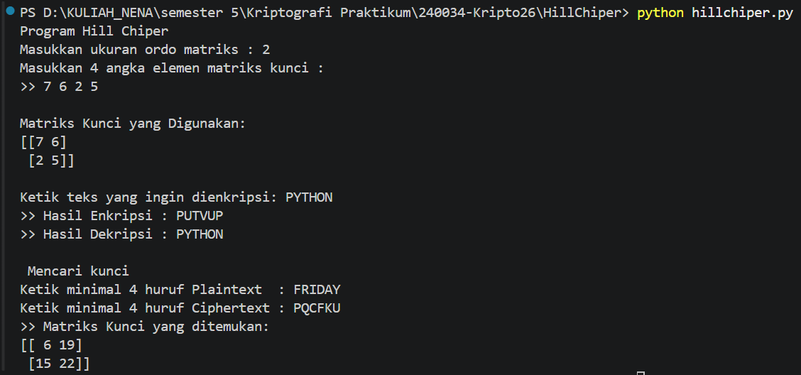

# Tugas 2 Praktikum Kriptografi - Hill Cipher

## Identitas
* **Nama:** Nena Haryadi Puspanegara
* **NPM:** 140810240034
* **Kelas:** Praktikum Kriptografi

---

## Penjelasan Alur Program

Program ini mengimplementasikan algoritma **Hill Cipher** menggunakan pustaka `numpy` untuk operasi aljabar matriks modulo 26. Program mendukung fungsi **enkripsi**, **dekripsi**, serta **pencarian matriks kunci (known-plaintext attack)**.

### 1. Invers Matriks Modulo 26 (`invers_matriks_mod26`)
* Menghitung determinan matriks dalam modulo 26: $\det(M) \pmod{26}$.
* Mencari invers perkalian determinan ($x$) sedemikian rupa sehingga $(\det \times x) \pmod{26} = 1$.
* Jika invers determinan tidak ditemukan ($\gcd(\det, 26) \neq 1$), fungsi mengembalikan `None`.
* Menghitung matriks adjoin dan mengalikannya dengan invers determinan: 
  $$M^{-1} = (\det^{-1} \times \text{adj}(M)) \pmod{26}$$

### 2. Alur Enkripsi (`enkripsi_hill`)
* **Preprocessing:** Teks diubah ke huruf kapital dan spasi dihapus.
* **Padding:** Jika panjang teks bukan kelipatan ordo matriks $n$, ditambahkan karakter dummy `'X'` di akhir teks.
* **Konversi Numerik:** Karakter diubah ke angka ($A=0, B=1, \dots, Z=25$).
* **Operasi Matriks:** Matriks teks dikalikan dengan matriks kunci $K$:
  $$C = (K \cdot P) \pmod{26}$$
* Angka hasil perkalian diubah kembali menjadi karakter huruf *ciphertext*.

### 3. Alur Dekripsi (`dekripsi_hill`)
* Program memanggil `invers_matriks_mod26(kunci)` untuk mendapatkan matriks kunci invers $K^{-1} \pmod{26}$.
* Jika matriks kunci tidak memiliki invers, program menampilkan pesan *error*.
* Matriks *ciphertext* dikalikan dengan matriks kunci invers:
  $$P = (K^{-1} \cdot C) \pmod{26}$$
* Angka hasil dikembalikan menjadi karakter huruf *plaintext*.

### 4. Mencari Kunci / Known-Plaintext Attack (`cari_kunci`)
* Mengambil $n \times n$ karakter pertama dari *plaintext* ($P$) dan *ciphertext* ($C$).
* Membentuk matriks $P$ dan $C$ berordo $n \times n$.
* Mencari matriks invers dari *plaintext* ($P^{-1} \pmod{26}$).
* Menghitung matriks kunci $K$ dengan rumus:
  $$K = (C \cdot P^{-1}) \pmod{26}$$

---

## Screenshot Running Program

