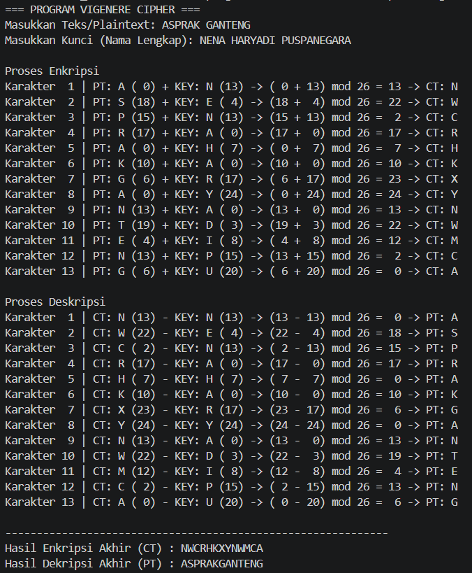

# Tugas 3 Praktikum Kriptografi - Vigenere Cipher

## Identitas
* **Nama:** Nena Haryadi Puspanegara
* **NPM:** 140810240034
* **Kelas:** b

---

## Deskripsi Program
Program ini menggunakan bahasa pemrograman Python untuk mengimplementasikan algoritma Vigenere Cipher (Enkripsi dan Dekripsi). Program ini menampilkan rincian pengerjaan step-by-step pada terminal, mulai dari konversi huruf ke angka, operasi modulo 26, hingga menghasilkan teks akhir.

---

## Rumus Matematika
1. **Enkripsi:** 
   $$C_i = (P_i + K_i) \pmod{26}$$
2. **Dekripsi:** 
   $$P_i = (C_i - K_i + 26) \pmod{26}$$

---

## Penjelasan Alur Program

Program ini mengimplementasikan algoritma **Vigenere Cipher** untuk proses enkripsi dan dekripsi teks menggunakan bahasa pemrograman Python. Alur jalannya program adalah sebagai berikut:

1. **Input Data**
   * Program meminta masukan teks asli (*Plaintext*) dan kunci (*Key*) dari pengguna melalui terminal.

2. **Pembersihan Teks (Preprocessing)**
   * Input *plaintext* dan *key* diubah menjadi huruf kapital (*uppercase*) dan seluruh spasi dihapus untuk menyamakan format karakter.

3. **Alur Enkripsi (`enkripsi_vigenere`)**
   * Program melakukan perulangan (*looping*) untuk setiap karakter pada *plaintext*.
   * Karakter diubah menjadi nilai numerik indeks $0 - 25$ ($A=0, B=1, \dots, Z=25$) menggunakan fungsi `ord(char) - 65`.
   * Karakter kunci disesuaikan posisi indeksnya menggunakan operasi modulo `i % len(key)`.
   * Nilai numerik *ciphertext* dihitung menggunakan rumus:
     $$C_i = (P_i + K_i) \pmod{26}$$
   * Angka hasil diubah kembali menjadi karakter huruf (`chr(c_num + 65)`).
   * Program mencetak rincian pengerjaan *step-by-step* per karakter ke terminal.

4. **Alur Dekripsi (`dekripsi_vigenere`)**
   * Program melakukan perulangan untuk setiap karakter pada *ciphertext*.
   * Mengubah karakter *ciphertext* dan *key* menjadi nilai numerik $0 - 25$.
   * Nilai numerik *plaintext* dihitung menggunakan rumus:
     $$P_i = (C_i - K_i + 26) \pmod{26}$$
   * Angka hasil dikembalikan menjadi karakter huruf semula.
   * Program mencetak rincian pengerjaan *step-by-step* per karakter ke terminal.

5. **Output Hasil**
   * Program menampilkan gabungan hasil akhir *Ciphertext* dan *Plaintext* hasil dekripsi secara keseluruhan di terminal.

---

## Screenshot Running Program
